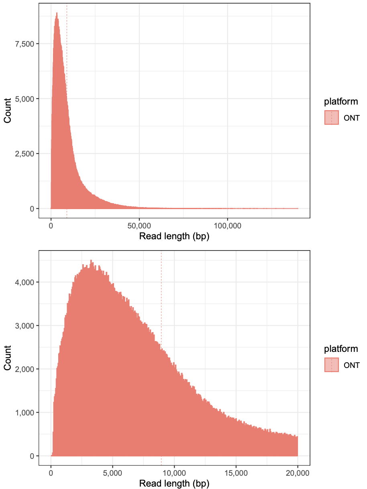

# Genome Assembly & Polishing of *Dictyostelium discoideum*

**Summary and Current Status**

---

## Table of Contents

1. Research Background
2. About *Dictyostelium discoideum*
3. Background Information
4. Data Used
5. ONT Read Length Distribution
6. Assembly Methods & Evaluation
7. Polishing Methods
8. Current Status
9. Future Directions
10. Acknowledgment

---

## 🔬 Research Background

- Genome assembly reconstructs the complete DNA sequence of an organism.
- High-quality assemblies are essential for understanding gene function, evolution, and genome structure.
- Short-read sequencing (e.g., Illumina) struggles with repetitive and complex regions.
- Long-read sequencing (e.g., ONT, PacBio) enables more contiguous and accurate assemblies.
- Improving assembly quality accelerates research in genetics, cell biology, and biotechnology.

---

## 🦠 About *Dictyostelium discoideum*

- A social amoeba, widely used as a model organism in cell and developmental biology.
- Belongs to the phylum Amoebozoa.
- Exhibits both unicellular and multicellular life stages.
- Genome: ~34 Mb, 6 nuclear chromosomes, extrachromosomal rDNA, and mitochondrial DNA.
- Used to study cell motility, chemotaxis, signaling, and evolution of multicellularity.
- Its genome is AT-rich and contains many repetitive elements.

---

## 🧬 Background Information

- **Nuclear chromosomes:** 6
- **Extrachromosomal palindrome (rDNA):** ~88 kb, ~100 copies (~20% of nuclear DNA)
- **Mitochondrial genome:** ~55.6 kb, ~200 copies
- **Ideal number of replicons:** 8 (6 chromosomes + rDNA + mitochondria)

---

### Genome Sequence Features

- **Total length:** ~33.89 Mb (chromosome assembly: 33,817,471 bp; unassigned: 69,589 bp)
- **Coverage:** 9.1×–10.3× (chromosomes 1–6), avg 8.3×
- **Contigs:** 309 (chromosome assembly), 34 (unassigned)
- **Estimated total gap:** 155,750 bp
- **AT-rich:** 77.57% A+T (G+C: 22.43%)
- **CpG depletion:** 62% of GpC (suggests cytosine methylation)
- **Simple sequence repeats:** >11% of genome
- **Transposons:** Many non-LTR retrotransposons, frequent near tRNA genes
- **tRNA genes:** 390 (high in eukaryotes), many tandem duplications

---

## 🧪 Data Used

- **ONT:** `Dicty_gDNA_NEB-2.fastq`
- **Illumina:** `Stationary_S1_R1.fastq.gz`, `Stationary_S1_R2.fastq.gz`
- **Subset:** `Dicty_gDNA_NEB-2_half.fastq.gz`

---

## 📊 ONT Read Length Distribution

**ONT Read Stats:**

```
sum = 8,359,638,019, n = 934,886, ave = 8,941.88, largest = 139,714
N50 = 12,777, n = 188,908
N60 = 10,380, n = 261,703
N70 = 8,415, n = 351,177
N80 = 6,569, n = 463,244
N90 = 4,537, n = 614,607
N100 = 19, n = 934,886
N_count = 0
Gaps = 0
```



*ONT data is the primary sequencing data for this project.*

---

## 🏗️ Assembly Methods

- **Assemblers tested:**
  - Flye
  - Canu
  - Raven
  - Shasta

### Evaluation by QUAST

| Metric              | Raven   | Flye    | Shasta   | Canu     |
|---------------------|---------|---------|----------|----------|
| # contigs           | 28      | 33      | 36       | 14       |
| Largest contig      | 5,803,050 | 5,006,538 | 12,082,896 | 8,736,265 |
| Total length        | 35,504,430 | 34,319,985 | 33,471,541 | 34,572,512 |
| N50                 | 2,694,088 | 2,870,802 | 6,719,217 | 3,611,137 |
| L50                 | 5       | 5       | 2        | 3        |
| GC (%)              | 22.77   | 22.98   | 22.90    | 23.06    |

- **Canu**: Fewest contigs (14), high N50, good balance
- **Shasta**: Largest contig and N50, but more contigs
- **Flye/Raven**: More contigs, lower N50
- **Conclusion:** Canu is the most accurate overall

---

## 🛠️ Polishing Methods

- **Pilon**: 2 rounds (ONT + Illumina reads)
  - Limited improvement in accuracy
- **Medaka**: 1 round (ONT reads)

---

## 📈 Current Status

- **Number of contigs:** 14
- **Goal:** 8 (6 chromosomes + rDNA + mitochondria)
- **Current best:** Canu (50%), Pilon (ONT50% + Illumina50%)

---

## 🚀 Future Directions

1. **Try polishing with other libraries/tools**
2. **Reduce contig number by scaffolding**
3. **Consider multi-assembly strategies**

