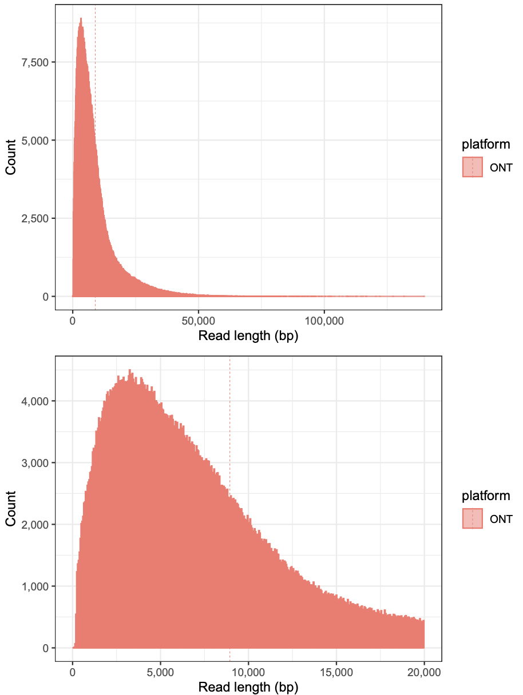
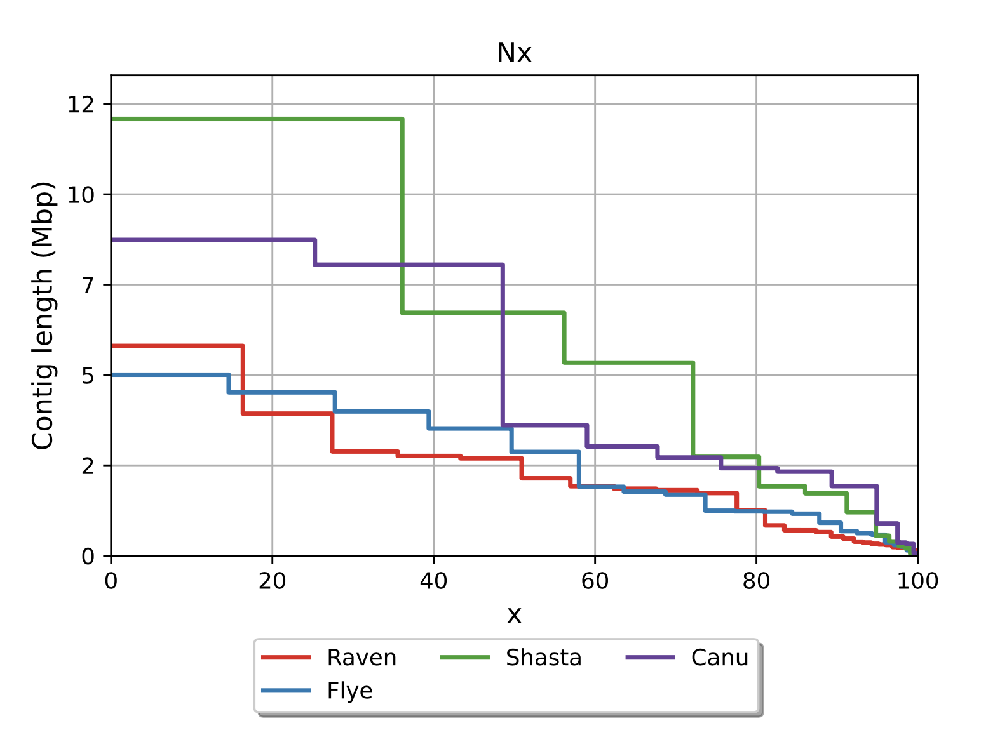
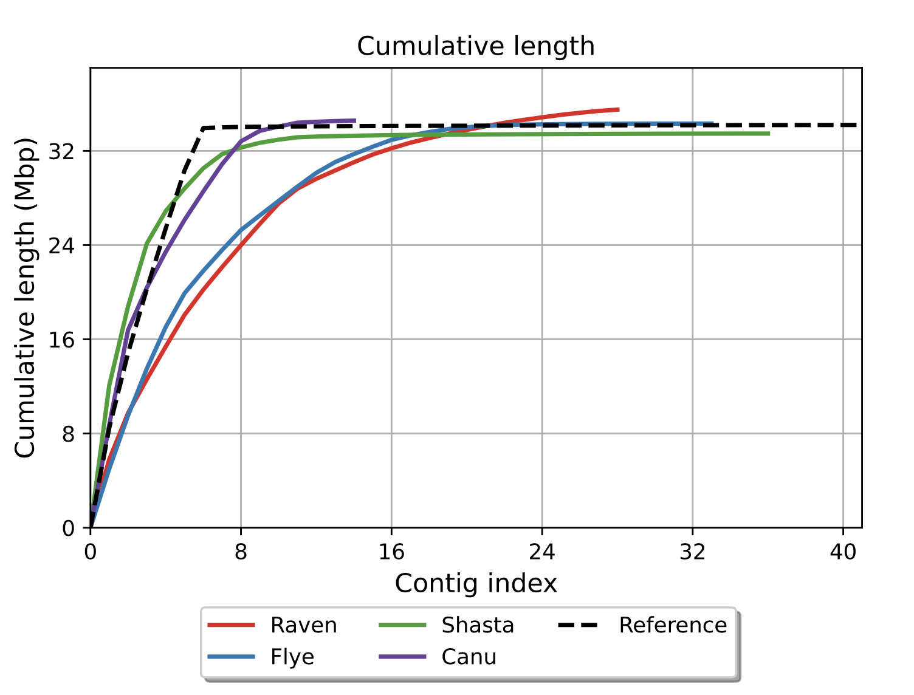
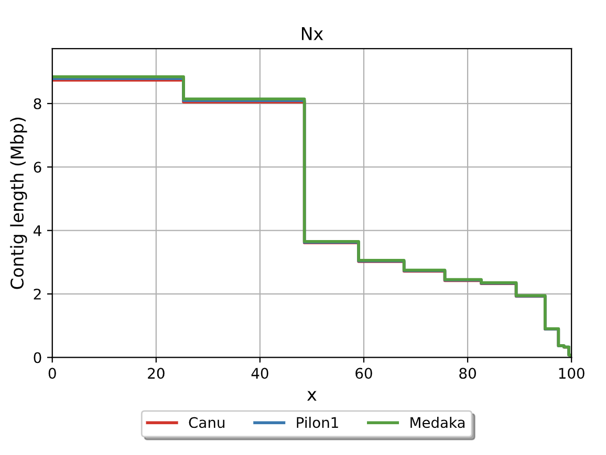
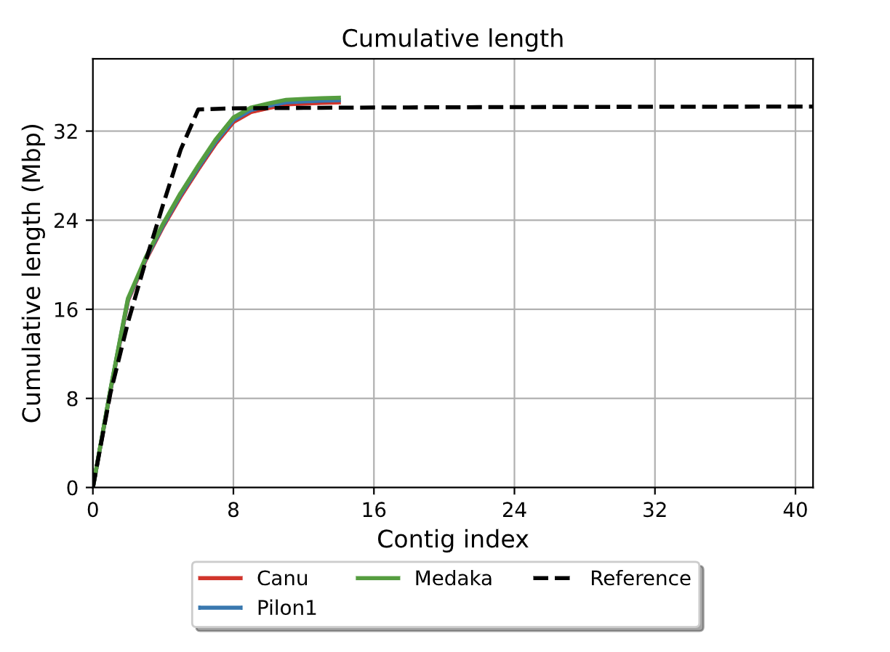

# *Dictyostelium discoideum*  
## ゲノムアセンブリ・ポリッシングまとめ

- **目的**：モデル生物 *D. discoideum* の高品質ゲノム配列構築  
- **意義**：細胞分化・運動・シグナル伝達研究の基盤情報提供  
- **対象者**：ゲノム解析初心者  

---

## 背景知識：*D. discoideum* について

- 社会性アメーバのモデル生物  
- 単細胞⇄多細胞 の生活環  
- ゲノムサイズ：約 34 Mb  
- 染色体：6本 + rDNA（約88 kb×100コピー） + ミトコンドリア（約56 kb）

**研究上の利点**：
- 真核生物でありながら、構造が比較的シンプル
- 発生生物学や細胞の社会性の研究に最適

**ゲノムの特徴**：
- ATリッチ（77.6%）な配列構成
- 多数のtRNA遺伝子（390本）を保有
- 単純繰り返し配列（SSR）が豊富（>11%）

---

## 現在までのゲノムアセンブリの流れ

1. **シーケンスデータの取得**  
   - ONT（ロングリード）  
   - Illumina（ショートリード）  
2. **品質評価・前処理**  
   - FastQCでリード品質を確認 
1. **アセンブリ実行**  
   - Canu / Flye / Raven / Shasta -> 比較
1. **ポリッシング（誤り修正）**  
   - Pilon / Medaka  
5. **評価・改善**  
   - QUAST で品質評価 → 必要に応じて再アセンブリ or Scaffolding  

---

## 使用データの概要

| データ種類         | ファイル名                                 | 特徴              |
| ------------- | ------------------------------------- | --------------- |
| ONT ロングリード    | `Dicty_gDNA_NEB-2.fastq`              | 最大 ~139 kb、誤読多い |
| Illumina 短リード | `Stationary_S1_R1.fastq.gz` / `S1_R2` | 高精度 ~150 bp     |

---

## ONTリード長分布



```bash
sum = 8,359,638,019 bp  
n = 934,886 リード  
平均長 = 8,941.88 bp  
最大長 = 139,714 bp  
N50 = 12,777 bp  
````

---

## アセンブリ実験の概要

- **使用データ**：ONTロングリードの約50%（4.2 Gb）を使用
  - 過剰なカバレッジは計算時間増加・精度低下の原因

- **使用ツールの特徴**：
  - Canu：エラー補正機能が強力、計算時間は長い
  - Flye：繰り返し配列に強い、メモリ効率が良い
  - Shasta：超高速だが、精度はやや劣る
  - Raven：メモリ使用量が少なく、高速

---

## アセンブリツール比較




| 指標         | Raven   | Flye    | Shasta  | Canu    |
| ---------- | ------- | ------- | ------- | ------- |
| contigs  | 28      | 33      | 36      | 14      |
| 最大 contig | 5.8 Mb  | 5.0 Mb  | 12.0 Mb | 8.7 Mb  |
| 総長         | 35.5 Mb | 34.3 Mb | 33.5 Mb | 34.6 Mb |
| N50        | 2.7 Mb  | 2.8 Mb  | 6.7 Mb  | 3.6 Mb  |
| GC含量 (%)   | 22.8    | 23.0    | 22.9    | 23.1    |

---

## ポリッシング実験の概要

- **実施手順**：
  1. Pilon（2回連続）
     - IlluminaリードとONTロングリードを使用
     - 塩基置換・インデルの修正に効果的
  2. Medaka（1回）
     - ONTリードを使用
     - ONT特有のエラーパターンを学習済み
     - ホモポリマー領域の修正に強い

---

## ポリッシング手法比較




| 指標                | 生データ | Pilon 1回目 | Pilon 2回目 | +Medaka |
| ----------------- | ------ | --------- | --------- | ------- |
| ミスマッチ率 (/100 kbp) | 256.34 | 165.23    | 128.52    | 134.82  |
| インデル率 (/100 kbp)  | 458.67 | 289.12    | 233.45    | 188.91  |
| ゲノムフラクション (%)     | 96.234 | 96.892    | 97.182    | 97.190  |

---

## 現状と課題

* **contig 本数**：14本（目標は 8本）
  * 目標の8本の内訳：6本の染色体 + rDNA + ミトコンドリア
  * 参照：染色体アセンブリは309本のcontigで構成（155箇所のギャップ）

* **総配列長**：35.0 Mb（参照 34.2 Mb）
  * 参照の詳細：染色体アセンブリ 33.82 Mb + 浮遊contig 0.07 Mb = 33.89 Mb

* **N50**：約 3.7 Mb
* **GC含量**：22.8%（参照 22.4%）
  * 参照の特徴：全ゲノムの77.57%がAT塩基

* **ゲノムフラクション**：97.2%
* **エラー率**：
  * ミスマッチ：134.8 /100 kbp
  * インデル：188.9 /100 kbp

**主な課題**：
* contig数の削減（14本→8本）
* ATリッチな領域の正確なアセンブリ
* 繰り返し配列（特にrDNA領域）の解決

---

## 今後の方針

1. **他ポリッシングツール検討**

   * Homopolish, NextPolish など
2. **Scaffolding導入**

   * RaGOO, SSPACE で contig 接続
3. **マルチアセンブリ統合**

   * 複数結果を統合しさらに精度向上


---

## まとめ

* ONT + Illumina の組合せでゲノムアセンブリを実施
* Canu がバランス良い結果
* Pilon/Medaka で誤り修正
* 次は Scaffolding & 他ツールで contig 数削減
