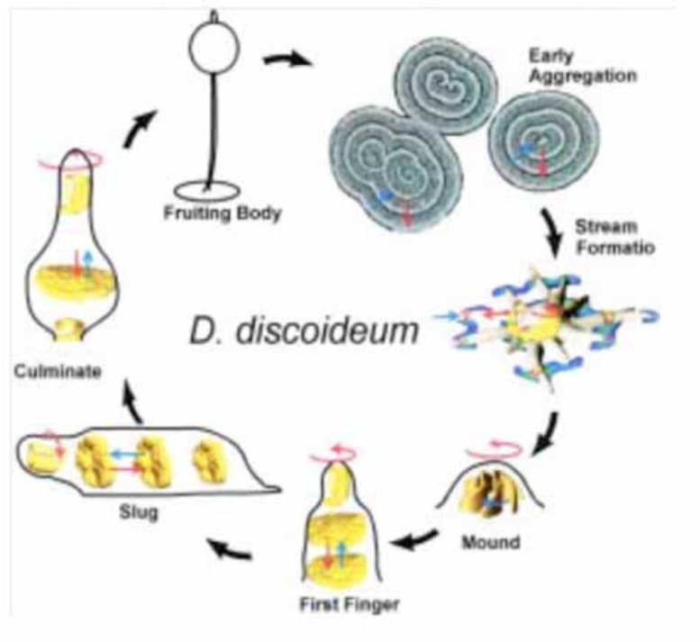
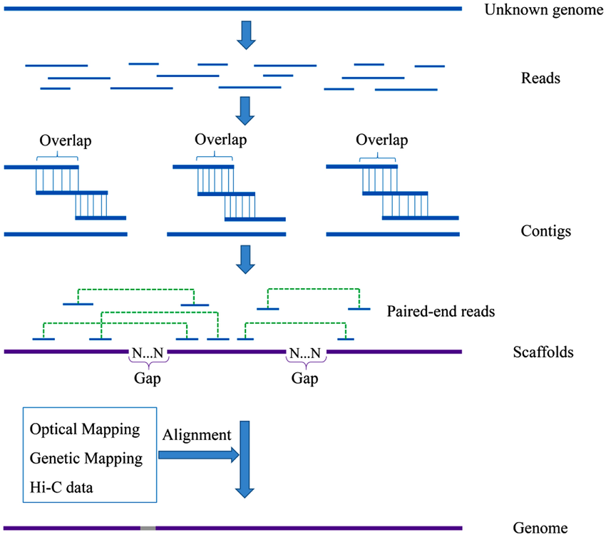
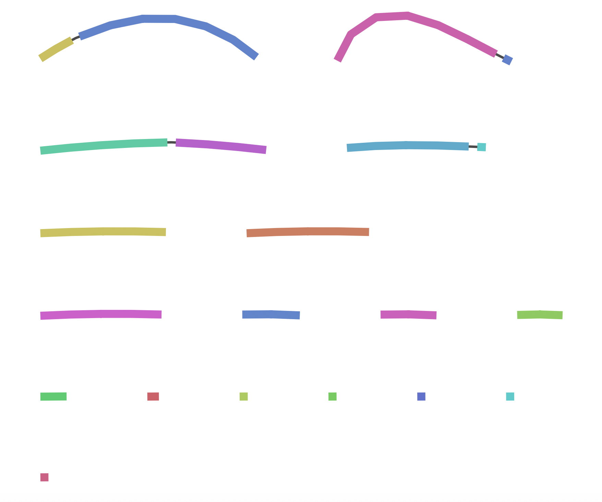
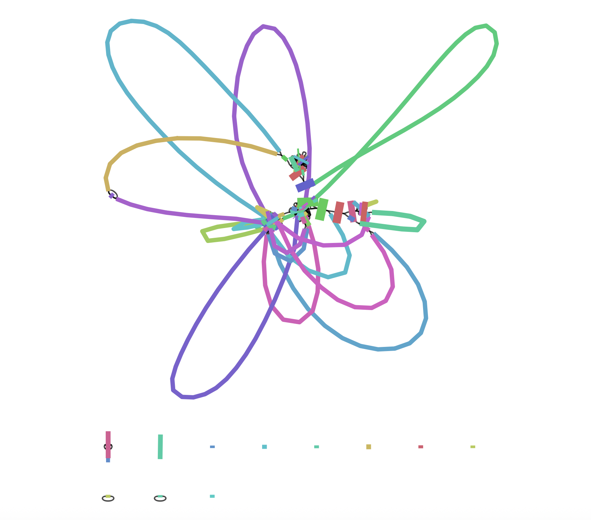
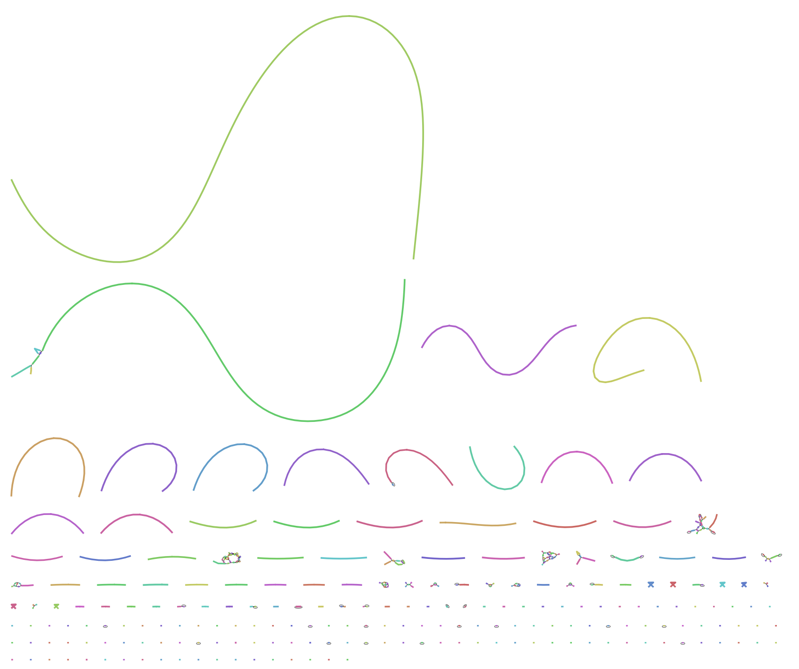

# *Dictyostelium discoideum*  
## Genome Assembly & Polishing Summary

- **Objective**: Construction of high-quality genome sequence for model organism *D. discoideum*  
- **Significance**: Providing foundational information for cell differentiation, motility, and signal transduction research  

---

## Background: About *D. discoideum*



- Model organism of social amoeba  
- Life cycle: Single-cell ⇄ Multicellular  
- Genome size: ~34 Mb  
- Chromosomes: 6 + rDNA (~88 kb×100 copies) + Mitochondria (~56 kb)

**Genome Characteristics**:
- AT-rich sequence composition (77.6%)
- Numerous tRNA genes (390 copies)
- Rich in simple sequence repeats (SSR) (>11%)

---

## Genome Assembly Workflow



1. **Sequence Data Acquisition**  
   - ONT (Long reads)  
   - Illumina (Short reads)  
2. **Quality Assessment & Preprocessing**  
   - Read quality confirmation 
3. **Assembly Execution**  
   - Canu / Flye / Raven / Shasta -> Comparison
4. **Polishing (Error Correction)**  
   - Pilon / Medaka  
5. **Evaluation & Improvement**  
   - Quality assessment with QUAST → Reassembly or Scaffolding as needed  

---

## Comparison of ONT and Illumina Data

|                | ONT Long Reads                | Illumina Short Reads         |
|----------------|------------------------------|-----------------------------|
| Read Length    | Very long (up to ~139 kb)    | Short (~150 bp)             |
| Accuracy       | Lower (high error rate)       | Very high                   |
| Error Type     | Indels, mismatches           | Rare, mostly substitutions  |
| Strengths      | Resolves repeats, large SVs  | Ideal for polishing         |
| Weaknesses     | Lower per-base accuracy       | Cannot span long repeats    |

- ONT reads provide long-range information but have higher error rates.
- Illumina reads are highly accurate and best for error correction.

---


## Key Terms for Read Length Analysis

- **Read**: A single DNA sequence obtained from a sequencing machine.
- **N50**: The read length at which 50% of the total bases are contained in reads of this length or longer. A higher N50 indicates longer reads on average.

---

## Dictyostelium discoideum ONT Read Length Distribution


```bash
# Total number of bases in the sequence
sum = 8,359,638,019 bp  

# Total number of reads
n = 934,886 reads       

 # Average read length
mean length = 8,941.88 bp 

# Length of the longest read
max length = 139,714 bp    

# Read length where 50% of total sequence 
N50 = 12,777 bp        
```

---

## Assembly Experiment Overview

- **Data Used**: ~50% of ONT long reads (4.2 Gb)
  - Why 50%?...Excessive coverage can lead to increased computation time and reduced accuracy
  - Also testing other coverage levels (e.g., 25% and 75%), but 50% was most accurate 

- **Assembly Tool Characteristics**:
  - Canu: Powerful error correction, longer computation time
  - Flye: Strong with repetitive sequences, good memory efficiency
  - Shasta: Ultra-fast but slightly lower accuracy
  - Raven: Low memory usage, high speed

---

## Assembly Result Comparison


<style scoped>
table {
  font-size: 18px;
}
</style>

| Metric         | Raven   | Flye    | Shasta  | Canu    |
| ---------- | ------- | ------- | ------- | ------- |
| contigs  | 28      | 33      | 36      | 14      |
| Largest contig | 5.8 Mb  | 5.0 Mb  | 12.0 Mb | 8.7 Mb  |
| Total length         | 35.5 Mb | 34.3 Mb | 33.5 Mb | 34.6 Mb |
| N50        | 2.7 Mb  | 2.8 Mb  | 6.7 Mb  | 3.6 Mb  |
| GC content (%)   | 22.8    | 23.0    | 22.9    | 23.1    |


---

## Assembly Selection: Reconsidering the Workflow

**Canu may provide the best performance:**
- Fewest contigs (14) → Closest to target (8)
- Most accurate total length (34.6 Mb ≈ 34.2 Mb reference)
- Well-balanced N50 and GC content

**However...**
- Based on feedback, it is important to thoroughly evaluate the accuracy of each assembly (e.g., by comparison with the reference genome and detailed metrics) before proceeding to polishing or scaffolding.
- The workflow will be revised to select the most accurate assembly after comprehensive evaluation, rather than assuming Canu is best by default.→ next step

---  
## Evaluate Assembly Accuracy (Coverage)

| **Canu**                       | **Flye**                       | **Shasta**                     |
|:------------------------------:|:------------------------------:|:------------------------------:|
|  |  |  |

---

## Polishing Experiment Overview (Canu)

- **Procedure**:
  1. Pilon (2 consecutive rounds)
     - Using Illumina reads and ONT long reads
     - Effective for base substitution and indel corrections
  2. Medaka (1 round)
     - Using ONT reads
     - Pre-trained on ONT-specific error patterns
     - Strong in homopolymer region correction

---

## Polishing Method Comparison


<style scoped>
table {
  font-size: 18px;
}
</style>

| Metric                | Raw Data | Pilon 1st | Pilon 2nd | Medaka |
| ----------------- | ------ | --------- | --------- | ------- |
| Mismatch rate (/100 kbp) | 256.34 | 165.23    | 128.52    | 134.82  |
| Indel rate (/100 kbp)  | 458.67 | 289.12    | 233.45    | 188.91  |
| Genome fraction (%)     | 96.234 | 96.892    | 97.182    | 97.190  |

**Progressive improvement through polishing:**
- **Pilon (2 rounds)**: Significantly reduced mismatch rate (256.34 → 128.52)
- **Medaka (final)**: Further improved indel rate (233.45 → 188.91)
- Overall genome coverage increased from 96.23% to 97.19%

---

## Current Status (Canu)

* **Number of contigs**: 14 (target is 8)

* **Total sequence length**: 35.0 Mb (reference 34.2 Mb)
  * Reference details: Chromosome assembly 33.82 Mb + floating contigs 0.07 Mb = 33.89 Mb

* **N50**: ~3.7 Mb
* **GC content**: 22.8% (reference 22.4%)
  * Reference characteristic: 77.57% of whole genome is AT bases

* **Genome fraction**: 97.2%
* **Error rates**:
  * Mismatches: 134.8 /100 kbp
  * Indels: 188.9 /100 kbp

---

## Future Directions

1. **Confirm whether Canu truly provides the highest accuracy (try with other assembly results)**

2. **Polishing**

   * Pilon, Homopolish, NextPolish, etc.
3. **Introduce Scaffolding**

   * Contig connection with RaGOO, SSPACE
4. **Multi-assembly Integration**

   * Integrate multiple results for further accuracy improvement
