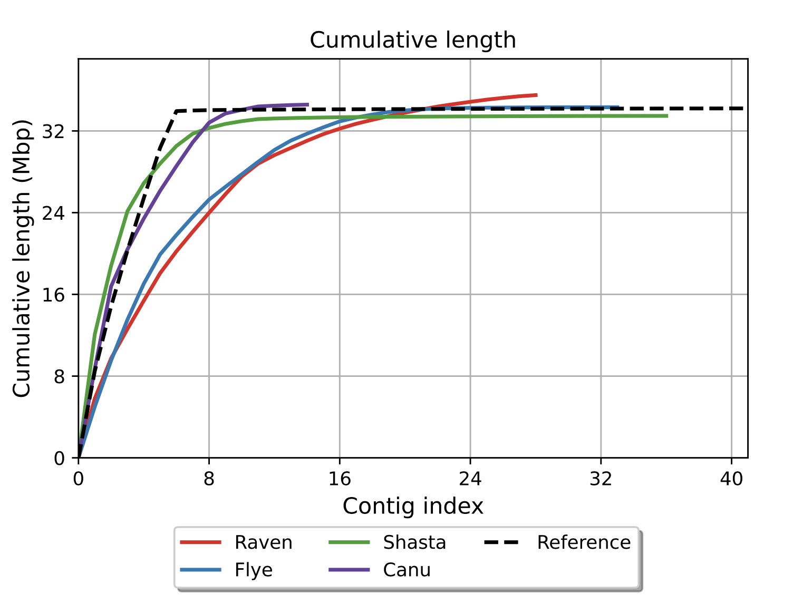

# *Dictyostelium discoideum*  
## Genome Assembly & Polishing Summary

- **Objective**: Construction of high-quality genome sequence for model organism *D. discoideum*  
- **Significance**: Providing foundational information for cell differentiation, motility, and signal transduction research  

<!--
Hello everyone. Today, I will talk about my project to make a high-quality genome sequence for Dictyostelium discoideum. This is a social amoeba that scientists use to study basic life processes. I will explain the steps I took and why this work is important.
-->

---

## Background: About *D. discoideum*


- Model organism of social amoeba  
- Life cycle: Single-cell ⇄ Multicellular  
- Genome size: ~34 Mb  
- Chromosomes: 6 + rDNA (~88 kb×100 copies) + Mitochondria (~56 kb)

**Genome Characteristics**:
- AT-rich sequence composition (77.6%)
- Numerous tRNA genes (390 copies)
- Rich in simple sequence repeats (SSR) (>11%)

<!--
Dictyostelium discoideum is special because it can live alone or join with others to form a group. Its genome is about 34 million base pairs, with 6 chromosomes, many rDNA copies, and mitochondria. It has a lot of A and T, many tRNA genes, and many simple repeats. These features make it interesting for research.
-->

---

## Genome Assembly Workflow


1. **Sequence Data Acquisition**  
   - ONT (Long reads)  
   - Illumina (Short reads)  
2. **Quality Assessment & Preprocessing**  
   - Read quality confirmation 
3. **Assembly Execution**  
   - Canu / Flye / Raven / Shasta -> Comparison
4. **Polishing (Error Correction)**  
   - Pilon / Medaka  
5. **Evaluation & Improvement**  
   - Quality assessment with QUAST → Reassembly or Scaffolding as needed  

<!--
Here is the overall workflow. First, I get DNA sequence data using ONT for long reads and Illumina for short, accurate reads. I check the quality, assemble the DNA, polish to fix mistakes, and check the quality again. Each step helps improve the final genome.
-->

---

## Comparison of ONT and Illumina Data

<style scoped>
table {
  width: 100%;
  font-size: 30px;
}
</style>

|                | ONT Long Reads                | Illumina Short Reads         |
|----------------|------------------------------|-----------------------------|
| Read Length    | Very long (up to ~139 kb)    | Short (~150 bp)             |
| Accuracy       | Lower (high error rate)       | Very high                   |
| Error Type     | Indels, mismatches           | Rare, mostly substitutions  |
| Strengths      | Resolves repeats, large SVs  | Ideal for polishing         |
| Weaknesses     | Lower per-base accuracy       | Cannot span long repeats    |

<!--
I used two types of sequencing data. ONT gives very long DNA reads, but they have more errors. Illumina gives short but very accurate reads. The long ONT reads help build the genome, and the short Illumina reads help fix small mistakes. Using both gives the best results.
-->

---

## Dictyostelium discoideum ONT Read Length Distribution


```bash
# Total number of bases in the sequence
sum = 8,359,638,019 bp  

# Total number of reads
n = 934,886 reads       

 # Average read length
mean length = 8,941.88 bp 

# Length of the longest read
max length = 139,714 bp    

# Read length where 50% of total sequence 
N50 = 12,777 bp        
```

<!--
This graph shows the length of ONT reads. There are about 930,000 reads, with an average length of 9,000 base pairs. The longest read is about 140,000 base pairs. N50 means half of the DNA is in reads longer than 12,777 base pairs. Having many long reads is good for making a complete genome.
-->

---

## Assembly Experiment Overview

- **Data Used**: ~50% of ONT long reads (4.2 Gb)
  - Why 50%?...Excessive coverage can lead to increased computation time and reduced accuracy
  - Also testing other coverage levels (e.g., 25% and 75%), but 50% was most accurate 

- **Assembly Tool Characteristics**:
  - Canu: Powerful error correction, longer computation time
  - Flye: Strong with repetitive sequences, good memory efficiency
  - Shasta: Ultra-fast but slightly lower accuracy
  - Raven: Low memory usage, high speed

<!--
For assembly, I used about half of the ONT data. Too much data can make the process slow and less accurate. I tried different software: Canu is good at fixing errors but slow, Flye is good with repeats, Shasta is very fast, and Raven is fast and uses little memory. Each tool has its own strengths.
-->

---

## Assembly Result Comparison




<style scoped>
table {
  width: 100%;
  font-size: 20px;
}
</style>

| Metric         | Raven   | Flye    | Shasta  | Canu    |
| ---------- | ------- | ------- | ------- | ------- |
| contigs  | 28      | 33      | 36      | 14      |
| Largest contig | 5.8 Mb  | 5.0 Mb  | 12.0 Mb | 8.7 Mb  |
| Total length         | 35.5 Mb | 34.3 Mb | 33.5 Mb | 34.6 Mb |
| N50        | 2.7 Mb  | 2.8 Mb  | 6.7 Mb  | 3.6 Mb  |

<!--
Here I compare the results from each assembly tool. Fewer contigs mean the genome is less fragmented. Shasta made the longest contig, but Canu made the fewest contigs, which is closer to the real chromosome number. The total length and N50 values show how complete and continuous the genome is. Shasta is best for long contigs, Canu is best for fewer contigs.
-->

---

## Evaluate Assembly Accuracy 

| **Canu**                       | **Flye**                       | **Shasta**                       | **Raven**                       |
|:------------------------------:|:------------------------------:|:------------------------------:|:------------------------------:|
|  |  |  |  |

<!--
These graphs show how well each assembly matches the reference genome. Shasta's result is the cleanest, with six long diagonal lines matching the chromosomes. Canu and Flye are also good, but not perfect. Raven's result is more fragmented. This means Shasta is the most accurate, followed by Flye and Canu.
-->

---

## Overall Assembly Evaluation

<style scoped>
table {
  width: 100%;
  font-size: 22px;
}
</style>

| Tool      | Evaluation                | Comments                                                                                       |
|-----------|---------------------------|-----------------------------------------------------------------------------------------------|
| **Shasta**| ⭐ Best for structure      | - Longest contig (12 Mb), top N50 (6.7 Mb)<br>- Nx/cumulative plots: covers most with few contigs<br>- Highest contig count (36) |
| **Canu**  | ⭐ High accuracy, low fragmentation | - Fewest contigs (14), good N50 (3.6 Mb), max contig 8.7 Mb<br>- Stable GC content<br>- Consistently strong in Nx/cumulative plots |
| **Raven** | △ Fast & practical        | - Longest total length (35.5 Mb), max contig 5.8 Mb<br>- N50/Nx lower than Shasta/Canu |
| **Flye**  | △ Balanced but weaker     | - Similar contig/N50 to Raven<br>- Max contig smaller (5 Mb), total length moderate (34.3 Mb)<br>- Stable GC (23.0%) |

<!--
This table summarizes the strengths of each tool. Shasta is best for long contigs, Canu is best for fewer contigs and high accuracy, Raven is fast, and Flye is balanced. We choose the tool based on what is most important for our project.
-->

---

## Polishing Experiment Overview (Canu)

- **Procedure**:
  1. Pilon (2 consecutive rounds)
     - Using Illumina reads and ONT long reads
     - Effective for base substitution and indel corrections
  2. Medaka (1 round)
     - Using ONT reads
     - Pre-trained on ONT-specific error patterns
     - Strong in homopolymer region correction

<!--
After assembly, I polished the Canu result to try to improve accuracy even more. First, I used Pilon twice, then Medaka. Polishing helps fix small errors that remain after assembly.
-->

---

## Polishing Method Comparison


<style scoped>
table {
  width: 100%;
  font-size: 18px;
}
</style>

| Metric                | Raw Data | Pilon 1st | Pilon 2nd | Medaka |
| ----------------- | ------ | --------- | --------- | ------- |
| Mismatch rate (/100 kbp) | 256.34 | 165.23    | 128.52    | 134.82  |
| Indel rate (/100 kbp)  | 458.67 | 289.12    | 233.45    | 188.91  |
| Genome fraction (%)     | 96.234 | 96.892    | 97.182    | 97.190  |

<!--
This table shows how polishing improves the genome. After Pilon and Medaka, the mismatch and indel rates go down, and the genome fraction goes up. This means the genome is more accurate and covers more of the reference.
-->

---

## Evaluate Accuracy Improvement

| **Before Polishing**                       | **Pilon+Medaka**                       | 
|:------------------------------:|:------------------------------:|
|  |  |
<!-- 
These images show the genome before and after polishing. Before polishing, the green lines are broken and shifted, showing errors. After polishing, the lines are straighter and more connected, meaning the genome matches the reference better. Polishing is like proofreading a paper to fix mistakes. It makes the genome cleaner and more accurate.
-->

---

## Future Directions

1. **Polishing Shasta Result**
   - Select better performing assembly for further improvement

2. **Advanced Polishing**
     * Homopolish (for homopolymer regions)
     * NextPolish (alternative approach)

3. **Introduce Scaffolding**
   - Apply scaffolding to polished assembly

4. **Multi-assembly Integration**
   - Combine best features from both assemblies

<!--
In the future, I will polish the Shasta result, try more advanced polishing tools, use scaffolding to connect contigs, and combine the best parts of different assemblies. This will help make the genome even more complete and accurate.
-->
