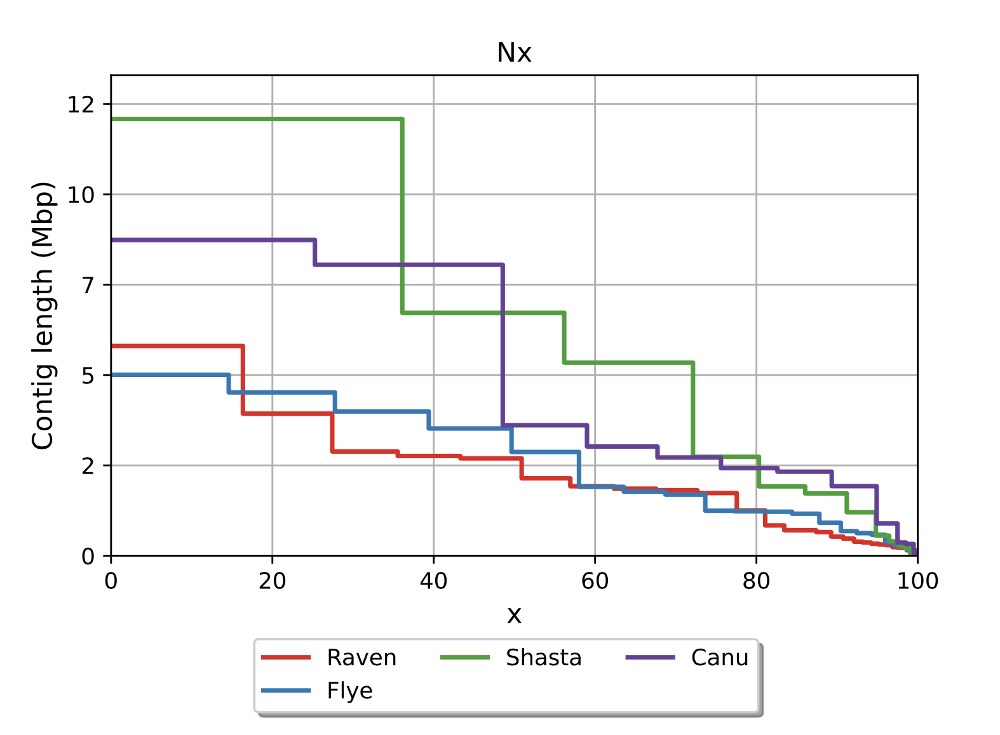

# *Progress Report #1*  
### 2025/6/9
##### Akinobu Ono


---

# *Dictyostelium discoideum Genome Assembly*  

- **Objective**: Construction of high-quality genome sequence for model organism (chromoosome level) *D. discoideum*  
- **Significance**: Centromere structure, chromosome segregation machinery, co-evolution analysis 

<!--
Hello everyone. Today, I will talk about my analytics to make a high-quality genome sequence for Dictyostelium discoideum. 
This is a social amoeba that scientists use to study basic life processes. 
My goal is to build a high-quality genome sequence for the model organism Dictyostelium discoideum at the chromosome level. 

This work is important because it will help studying the structure of centromeres, which are crucial for chromosome segregation during cell division. 
Additionally, it will allow to analyze how different parts of the genome have evolved together, providing insights into the organism's biology and evolution.

I will explain the steps I took.
-->

---

## Background: About *D. discoideum*


* Model organism of social amoeba
* Life cycle: Single-cell ⇄ Multicellular
* Genome size: \~34.2 Mb
* Chromosomes: 6 + extrachromosomal rDNA (\~88 kb × \~100 copies) + mitochondria (\~56 kb)

**Genome Characteristics**

* **AT-rich genome (77.6%)** – Challenges sequencing due to polymerase slippage, requiring long reads.
* **Numerous tRNA genes (≈ 390 copies)** – Similar clustered genes complicate assembly, needing long reads for accurate placement.
* **SSR-rich (> 11%)** – Dense repeats cause assembly ambiguities but can serve as markers.


<!--
Speaker notes:
The nuclear genome of *D. discoideum* is ~34 Mb across six chromosomes. In addition, ~100 copies of an 88 kb extrachromosomal rDNA palindrome and a 56 kb mitochondrial genome are present.

Key genomic quirks influence assembly strategy:

● The genome is extremely AT‑rich (~77.6%)【turn0search0】【turn0search3】, which lowers sequence complexity and leads to polymerase slippage; long-read platforms (ONT/PacBio) mitigate this by spanning homopolymer tracts.

● About 390 tRNA genes are dispersed genome‑wide【turn0search1】【turn0search6】. Their repetitive, nearly identical sequences can collapse during assembly; flanking unique sequence in long reads helps place them correctly.

● >11 % of nucleotides lie in short simple‑sequence repeats (SSRs)【turn0search4】【turn0search10】. These repeats fragment short‑read assemblies but are useful later as polymorphic markers for linkage mapping and strain typing.

Together these features justify a hybrid pipeline: long‑reads for contiguous assembly, Illumina for accuracy, followed by repeat‑aware polishers and manual curation at tRNA/SSR loci.
-->

---
## Comparison of ONT and Illumina Data

<style scoped>
table {
  width: 100%;
  font-size: 30px;
}
</style>

|                | ONT Long Reads                | Illumina Short Reads         |
|----------------|------------------------------|-----------------------------|
| Read Length    | Very long (up to ~139 kb)    | Short (~150 bp)             |
| Accuracy       | Lower (high error rate)       | Very high                   |
| Error Type     | Indels, mismatches           | Rare, mostly substitutions  |
| Strengths      | Resolves repeats, large SVs  | Ideal for polishing         |
| Weaknesses     | Lower per-base accuracy       | Cannot span long repeats    |

<!--
ONT Long Reads Characteristics:
Very long read length (up to ~139kb)
Lower accuracy (high error rate)
Mainly indels and mismatches (挿入・欠失）やミスマッチ
Strengths: Strong in resolving repeats and large structural variations
Weaknesses: Lower per-base accuracy

Illumina Short Reads Characteristics:
Short read length (~150bp)
Very high accuracy
Errors are mostly substitutions (置換)
Strengths: Ideal for polishing (error correction)
Weaknesses: Cannot span long repeats

By combining these two types of data, we can achieve high-quality genome assembly by leveraging their respective strengths. The complementary approach of using ONT's long reads to understand large structures and Illumina's high-accuracy reads for error correction is highly effective.
-->

---

## Genome Assembly Workflow


1. **Sequence Data Acquisition**  
   - ONT (Long reads)  
   - Illumina (Short reads)  
2. **Quality Assessment & Preprocessing**  
   - Read quality confirmation 
3. **Assembly Execution**  
   - Canu / Flye / Raven / Shasta 
   → Comparison with QUAST
4. **Polishing (Error Correction)**  
   - Pilon / Medaka  
5. **Evaluation & Improvement**  
   - Quality assessment with QUAST → Reassembly or Scaffolding as needed  

<!--

Let me explain my genome assembly workflow.

First, I used two types of DNA sequencing data　as i explained previous slide:
- Long reads　but not very accrate reads from (ONT)
- Short but very accurate reads from Illumina

My workflow consisted of five main steps:

1. I started by checking the quality of my sequencing data to ensure it was good enough for assembly by visualizing params of reads.

2. For the actual assembly, I tried four different tools:
   - Canu
   - Flye
   - Raven
   - Shasta
   This allowed me to compare their performance.

3. After assembly, I fixed errors using two polishing tools:
   - Pilon
   - Medaka
   These tools help correct any mistakes in the assembly.

4. Finally, I evaluated my results using QUAST to see how good my assembly was.

This systematic approach helped me create a high-quality genome assembly for my research.

-->

---


## Dictyostelium discoideum ONT Read Length Distribution


```bash
# Total length of bases in the sequence
sum = 8,359,638,019 bp  

# Total number of reads
n = 934,886 reads       

# Average read length
mean length = 8,941.88 bp 

# Length of the longest read
max length = 139,714 bp    

# Read length where 50% of total sequence 
N50 = 12,777 bp        
```

<!-- 
N50 is a commonly used metric in genomics that represents the length at which 50% of the total sequence length is contained in reads of that length or longer. 
A higher N50 value generally indicates better quality sequencing data, as it suggests we have more long reads available for assembly. 
This graph shows the distribution of read lengths from ONT sequencing.
In the top panel, you can see the overall distribution. Most of the reads are relatively short, with a peak around 1,000 to 5,000 base pairs. However, there are also some very long reads, with the longest exceeding 100,000 base pairs.
The bottom panel zooms in on reads up to 20,000 base pairs. Here, you can clearly see that the average read length is around 9,000 base pairs, and the N50 value　is also in this range.
Having many short reads is common in ONT sequencing, but There are also long reads.
-->

---

## Assembly Experiment Overview

- **Data Used**: ~50% of ONT long reads (4.2 Gb)
  - Why 50%?...Excessive coverage can lead to increased computation time and reduced accuracy
  - Also testing other coverage levels (e.g., 25% and 75%), but 50% was most accurate 

- **Assembly Tool Characteristics**:
  - Canu: Powerful error correction, longer computation time
  - Flye: Strong with repetitive sequences, good memory efficiency
  - Shasta: Ultra-fast but slightly lower accuracy
  - Raven: Low memory usage, high speed

<!--
For the assembly, I used about 50% of the ONT long reads, which is around 4.2 gigabases of data.

If I use too much data, or have excessive coverage, it can actually make the assembly slower and sometimes even reduce the accuracy.
I also tested other coverage levels, like 25% and 75%, but I found that using 50% gave the most accurate results in my experiments.

For assembly I tried different software: Canu is good at fixing errors but slow, Flye is good with repeats, Shasta is very fast, and Raven is fast and uses little memory. Each tool has its own strengths.
-->

---

## Assembly Result Comparison




<style scoped>
table {
  width: 100%;
  font-size: 16px;
}
</style>

<table>
  <thead>
    <tr>
      <th>Metric</th>
      <th>Raven</th>
      <th>Flye</th>
      <th>Shasta</th>
      <th>Canu</th>
    </tr>
  </thead>
  <tbody>
    <!-- contigs: 少ないほど優 -->
    <tr>
      <td><strong>contigs</strong></td>
      <td class="fair">28</td>
      <td class="poor">33</td>
      <td class="poor">36</td>
      <td class="best">14</td>
    </tr>
    <!-- Largest contig: 大きいほど優 -->
    <tr>
      <td><strong>Largest contig</strong></td>
      <td class="good">5.8 Mb</td>
      <td class="fair">5.0 Mb</td>
      <td class="best">12.0 Mb</td>
      <td class="good">8.7 Mb</td>
    </tr>
    <!-- Total length: 参照 ~34.2Mb に近いほど良 -->
    <tr>
      <td><strong>Total length (Expected longer than ~34.2 Mb)</strong></td>
      <td class="poor">35.5 Mb</td> <!-- 少し長すぎ -->
      <td class="good">34.3 Mb</td>
      <td class="poor">33.5 Mb</td> <!-- 少し短すぎ -->
      <td class="good">34.6 Mb</td>
    </tr>
    <!-- N50: 大きいほど優 -->
    <tr>
      <td><strong>N50</strong></td>
      <td class="fair">2.7 Mb</td>
      <td class="fair">2.8 Mb</td>
      <td class="best">6.7 Mb</td>
      <td class="good">3.6 Mb</td>
    </tr>
  </tbody>
</table>


<!-- 1. Number of contigs Represents how fragmented the assembly is. A lower number is generally better, as it indicates the genome is assembled into fewer, larger pieces. Canu produced the fewest contigs (14), suggesting the most complete assembly.

1. **Largest contig** Shows the size of the longest continuous sequence in the assembly. Shasta produced the largest contig (12.0 Mb), indicating it was able to assemble longer continuous regions than other tools.

2. **Total length** is The sum of all contig lengths. All assemblers produced similar total lengths (33.5-35.5 Mb), which is close to the expected genome size, suggesting good coverage of the genome. Raven tends to leave some repeat or duplicated regions unmerged, resulting in a total length larger than the reference (Raven = 35.5 Mb). In contrast, Shasta may over-collapse or skip repeats, leading to a total length smaller than the reference (Shasta = 33.5 Mb).

3. **N50** is A measure of contig length distribution as I explaines previous slide. Shasta's N50 of 6.7 Mb is the highest, indicating it produced the most continuous assembly among the tools tested. -->

---

## Evaluate Assembly Accuracy 
| **Canu**                       | **Flye**                       | **Shasta**                       | **Raven**                       |
|:------------------------------:|:------------------------------:|:------------------------------:|:------------------------------:|
|  |  |  |  |
<!-- ## Dotplot Analysis: Assembly Quality Assessment

I explain the results of the assembly quality assessment for each tool.
First, Shasta showed almost perfect linear alignment. The contigs matched the reference genome very well, with minimal gaps or inversions. 
There were six large continuous regions, which likely represent the six chromosomes. This suggests that Shasta reconstructed the chromosome structure very accurately.
Canu also performed well, but there were some issues. I observed multiple gaps and inversions in some contigs. Also, several contigs mapped to the same chromosome, which means the assembly was more fragmented. Some short contigs might be misassembled or unnecessary.
Flye gave results similar to Shasta, but there were some notable misalignments and breaks, especially around chromosomes 3 and 6. The linear structure was less clear in some regions.
Raven was the most fragmented. There were many short, fragmented contigs, frequent unaligned regions, and changes in orientation. The long-range continuity was poor.
In conclusion, Shasta gave the best results for preserving chromosome-level structure. 
 -->

---

## BUSCO Score

<style scoped>
table { width: 100%; font-size: 16px; }
th, td { padding: 6px 8px; text-align: center; border: 1px solid #ddd; }
th { background:#424242; color:#fff; }
.best { background:#c8e6c9; }  /* most favorable */
.good { background:#e8f5e9; }
.fair { background:#fff8e1; }
.poor { background:#ffebee; }
</style>

| Metric                    | **Canu**                             | **Shasta**                           | **Raven**                            | **Flye**                             | **Description & Ideal**                                                                            |
| ------------------------- | ------------------------------------ | ------------------------------------ | ------------------------------------ | ------------------------------------ | -------------------------------------------------------------------------------------------------- |
| **Complete (C)**          | <span class="best">94.9 %</span>     | <span class="good">91.4 %</span>     | <span class="best">94.9 %</span>     | <span class="best">94.9 %</span>     | Fraction of expected genes found completely. Higher is better (ideally > 95 %).                    |
| • Single-copy (S)         | 236 (92.5 %)                         | 229 (89.8 %)                         | 235 (92.2 %)                         | 236 (92.5 %)                         | Single-copy orthologs without duplication. Should be high to show low redundancy (ideally > 90 %). |
| • Duplicated (D)          | 6 (2.4 %)                            | 4 (1.6 %)                            | 7 (2.7 %)                            | 6 (2.4 %)                            | Orthologs found more than once. Low duplicated count is good (ideally < 5 %).                      |
| **Fragmented (F)**        | 3 (1.2 %)                            | 3 (1.2 %)                            | 3 (1.2 %)                            | 3 (1.2 %)                            | Partial matches of expected genes. Lower is better (ideally < 2 %).                                |
| **Missing (M)**           | <span class="best">10 (3.9 %)</span> | <span class="fair">19 (7.5 %)</span> | <span class="best">10 (3.9 %)</span> | <span class="best">10 (3.9 %)</span> | Genes not detected. Fewer missing is better (ideally < 5 %).                                       |
| **Stop-codon errors (E)** | 2 (0.8 %)                            | 1 (0.4 %)                            | 2 (0.8 %)                            | 3 (1.2 %)                            | Complete genes containing internal stops. Few errors are acceptable (ideally < 1 %).               |
| **Total BUSCOs (n)**      | 255                                  | 255                                  | 255                                  | 255                                  | Number of BUSCO groups searched. Always constant for the chosen lineage.                           |                 |

<!--

“Here is the BUSCO quality check for our two best assemblies.

BUSCO scores help to check how complete the genome assembly is by looking for important genes that should be there.  
Canu captures almost 95 % of all single-copy orthologs – really nice.  
Shasta is still good at 91 %, but a little lower.

For missing genes, Canu leaves only ten (3.9 %), while Shasta misses nineteen (7.5 %).  
That’s why Canu looks better overall in completeness.

On the other hand, the internal stop-codon warning is tiny for both: two hits in Canu (0.8 %), one hit in Shasta (0.4 %) – so no big concern.

Take-home message:  
If we prioritize completeness and low missing rate, Canu wins.  
But Shasta is not far behind and still gives us that strong structure we saw earlier.”
-->


---

## Overall Assembly Evaluation

<style scoped>
table {
  width: 100%;
  font-size: 22px;
}
</style>

| Tool      | Evaluation                | Comments                                                                                       |
|-----------|---------------------------|-----------------------------------------------------------------------------------------------|
| **Canu**  | ⭐ High accuracy, low fragmentation | - Fewest contigs (14), good N50 (3.6 Mb), max contig 8.7 Mb<br>- Consistently strong in Nx/cumulative plots |
| **Shasta**| 🟢 Good for structure      | - Longest contig (12 Mb), top N50 (6.7 Mb)<br>- Nx/cumulative plots: covers most with few contigs<br>- Highest contig count (36) |
| **Flye**  | △ Balanced     | - Similar contig/N50 to Raven<br>- Max contig smaller (5 Mb), total length moderate (34.3 Mb) |
| **Raven** | △ Fast & practical        | - Longest total length (35.5 Mb), max contig 5.8 Mb<br>- N50/Nx lower than Shasta/Canu |

<!--
This table summarizes the strengths of each assembly tool.
Shasta is the best for preserving chromosome structure. It produced the longest contig at 12 megabases and had the highest N50 value of 6.7 megabases. It also covered most of the genome with relatively few contigs, although the total number of contigs was the highest.
Canu achieved the highest accuracy with the least fragmentation. It produced the fewest contigs—only 14—with a good N50 of 3.6 megabases and a maximum contig length of 8.7 megabases. Its performance was consistently strong in the Nx and cumulative plots.
Depending on what is most important for our project—such as having fewer contigs, or achieving the longest contig and top N50 values—we decided to focus our further analysis on Shasta and Canu. These two tools showed the best performance in terms of contig number and assembly continuity, so we selected them for the next steps of our study.
-->

---

## Polishing Experiment Overview

**Polishing**...Process of correcting errors in the assembled genome sequence to improve its accuracy.

- **Procedure**:
  1. Pilon
     - Using Illumina reads and ONT long reads
     - Effective for base substitution and indel corrections
  2. Medaka
     - Using ONT reads
     - Pre-trained on ONT-specific error patterns
     - Strong in homopolymer region correction

<!--
First, I ran Polising with Canu, which has the fewest number of contigs, and I see if the accuracy would improve.
if this assembly is correct, I can expect significant improvement in accuracy through polishing.
First, I used Pilon twice, then Medaka. Polishing helps fix small errors that remain after assembly.
-->

---

<!-- ## Canu & Shasta Polishing Result

<style scoped>
table {
  width: 100%;
  font-size: 18px;
}
</style>

<table>
  <thead>
    <tr>
      <th>Metric</th>
      <th>Raw Data</th>
      <th>Pilon 1st</th>
      <th>Pilon 2nd</th>
      <th>Medaka</th>
    </tr>
  </thead>
  <tbody>
    <tr>
      <td><strong>Mismatch rate (/100 kbp)</strong></td>
      <td class="poor">256.34</td>
      <td class="fair">165.23</td>
      <td class="best">128.52</td>
      <td class="good">134.82</td>
    </tr>
    <tr>
      <td><strong>Indel rate (/100 kbp)</strong></td>
      <td class="poor">458.67</td>
      <td class="fair">289.12</td>
      <td class="good">233.45</td>
      <td class="best">188.91</td>
    </tr>
    <tr>
      <td><strong>Genome fraction (%)</strong></td>
      <td class="poor">96.234</td>
      <td class="fair">96.892</td>
      <td class="good">97.182</td>
      <td class="best">97.190</td>
    </tr>
  </tbody>
</table>

<!--
This is the result of Polishing

1. Mismatch rate (/100 kbp) is Number of base substitutions per 100 kilobases. A lower value indicates better accuracy in base calling.
2. Indel rate (/100 kbp) is  Number of insertions and deletions per 100 kilobases. A lower value shows better preservation of sequence length and structure.
3. Genome fraction (%): Percentage of the reference genome covered by the assembly. A higher value indicates more complete genome coverage.

The improvement in these metrics after polishing demonstrates that both Pilon and Medaka successfully enhanced the assembly quality by correcting errors and increasing genome coverage.
--> -->

## Evaluate Canu Accuracy Improvement

| **Canu Before Polishing**                       | **Canu Pilon+Medaka**                       |
|:------------------------------:|:------------------------------:|
|  |  |
<!-- 
-->

---
## Evaluate Shasta Accuracy Improvement

| **Shasta Before Polishing**                       | **Shasta Pilon**                       |
|:------------------------------:|:------------------------------:|
|  |  |
<!-- 
-->

---

## Future Directions

1. **Compare Polishing Result**
   - Select better performing assembly for further improvement

2. **Advanced Polishing**
     * Homopolish (for homopolymer regions)
     * NextPolish (alternative approach)

3. **Introduce Scaffolding**
   - Apply scaffolding to polished assembly

4. **Multi-assembly Integration**
   - Combine best features from both assemblies

<!--
In the future, I will polish the Shasta result, try more advanced polishing tools, use scaffolding to connect contigs, and combine the best parts of different assemblies. This will help make the genome even more complete and accurate.

1. **Polishing Shasta Result**
   - Apply Pilon and Medaka to the Shasta assembly
   - This could potentially improve the already high-quality assembly further
   - Focus on correcting any remaining small errors while maintaining the excellent chromosome-level structure

2. **Advanced Polishing**
   - Homopolish: Specifically targets homopolymer regions (stretches of identical nucleotides)
   - NextPolish: An alternative polishing pipeline that might catch errors missed by other tools
   - These tools can address specific types of errors that standard polishing might miss
   - Particularly useful for improving accuracy in challenging genomic regions

3. **Introduce Scaffolding**
   - Apply scaffolding to connect contigs into larger sequences
   - Use long-read data to bridge gaps between contigs
   - This could help resolve any remaining structural issues
   - Important for achieving chromosome-level assembly

4. **Multi-assembly Integration**
   - Combine best features from both Shasta and Canu assemblies
   - Use Shasta's superior chromosome-level structure as the backbone
   - Incorporate Canu's accurate regions where they show better quality
   - This hybrid approach could potentially yield the best possible assembly
-->
