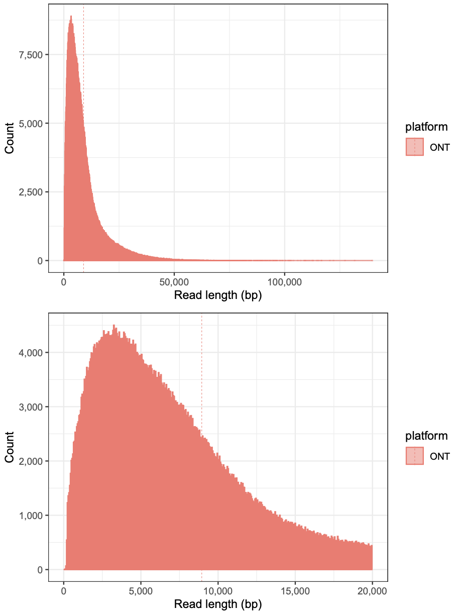
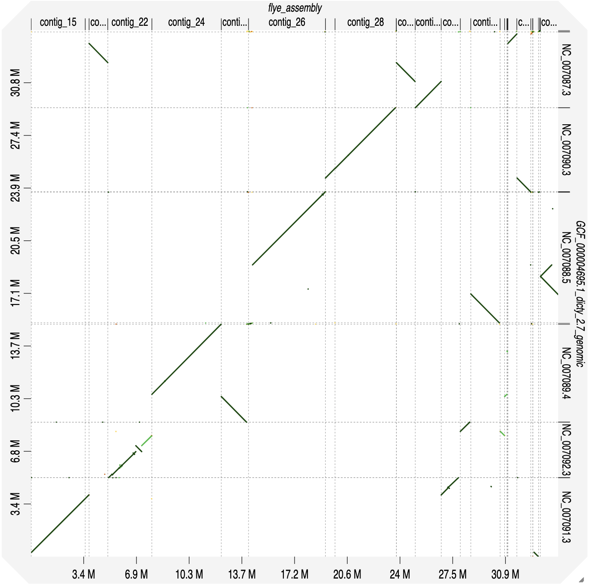

# *進捗報告 #1*  
### 2025/6/9
##### 小野 晃信

---

# *Dictyostelium discoideum ゲノムアセンブリ*  

- **目的**: *D. discoideum* の**染色体レベル**高品質ゲノム配列の構築  
- **意義**: セントロメア構造、染色体分配機構、共進化解析

---

## 背景: *D. discoideum* について


* 社会性アメーバのモデル生物
* ライフサイクル: 単細胞 ⇄ 多細胞
* ゲノムサイズ: 約34.2 Mb
* 染色体: 6本 + 染色体外rDNA（約88kb × 約100コピー）+ ミトコンドリア（約56kb）

**ゲノムの特徴**

* **ATリッチゲノム（77.6%）** – ポリメラーゼのスリッページでシーケンス困難、長鎖リードが必要
* **多数のtRNA遺伝子（約390コピー）** – 似た配列が集まるためアセンブリ困難、長鎖リードで正確な配置が必要
* **SSRが多い（>11%）** – 繰り返しが多くアセンブリが曖昧になるが、マーカーとして有用

---

## ONTとIlluminaデータの比較

|                | ONTロングリード                | Illuminaショートリード         |
|----------------|------------------------------|-----------------------------|
| リード長       | 非常に長い（最大約139kb）     | 短い（約150bp）              |
| 精度           | 低い（エラー率高い）           | 非常に高い                   |
| エラータイプ   | インデル、ミスマッチ           | 稀、主に置換                 |
| 強み           | 繰り返し・大規模構造変化に強い | ポリッシングに最適           |
| 弱み           | 塩基ごとの精度が低い           | 長い繰り返しをカバーできない  |

---

## ゲノムアセンブリのワークフロー


1. **シーケンスデータ取得**  
   - ONT（ロングリード）  
   - Illumina（ショートリード）  
2. **品質評価・前処理**  
   - リード品質の確認
3. **アセンブリ実行**  
   - Canu / Flye / Raven / Shasta  
   → QUASTで比較
4. **ポリッシング（エラー修正）**  
   - Pilon / Medaka  
5. **評価・改良**  
   - QUASTで品質評価 → 必要に応じて再アセンブリやスキャフォルディング

---

## Dictyostelium discoideum ONTリード長分布



```bash
# 配列中の塩基総長
sum = 8,359,638,019 bp  

# リード総数
n = 934,886 reads       

# 平均リード長
mean length = 8,941.88 bp 

# 最長リード
max length = 139,714 bp    

# N50（全塩基長の50%を占めるリード長）
N50 = 12,777 bp        
```

---

## アセンブリ実験の概要

- **使用データ**: ONTロングリードの約50%（4.2 Gb）
  - なぜ50%?...カバレッジが多すぎると計算時間増・精度低下の恐れ
  - 他のカバレッジ（25%、75%など）も検証したが、50%が最も高精度

- **アセンブリツールの特徴**:
  - Canu: 強力なエラー修正、計算時間長い
  - Flye: 繰り返し配列に強く、メモリ効率良い
  - Shasta: 超高速だがやや精度低い
  - Raven: メモリ消費少なく高速

---

## アセンブリ結果比較


| 指標         | Raven      | Flye       | Shasta     | Canu       |
|--------------|------------|------------|------------|------------|
| contigs数    | 28         | 33         | 36         | 14         |
| 最大contig長 | 5.8 Mb     | 5.0 Mb     | 12.0 Mb    | 8.7 Mb     |
| 総長         | 35.5 Mb    | 34.3 Mb    | 33.5 Mb    | 34.6 Mb    |
| N50          | 2.7 Mb     | 2.8 Mb     | 6.7 Mb     | 3.6 Mb     |

---

## アセンブリ精度評価
| **Canu**                       | **Flye**                       | **Shasta**                       | **Raven**                       |
|:------------------------------:|:------------------------------:|:------------------------------:|:------------------------------:|
|  |  |  |  |

---

## BUSCOスコア

| 指標                    | **Canu**   | **Shasta** | **Raven**  | **Flye**   | **説明・理想値** |
|-------------------------|------------|------------|------------|------------|-----------------|
| 完全（C）               | 94.9 %     | 91.4 %     | 94.9 %     | 94.9 %     | 期待遺伝子の完全検出率。高いほど良い（>95%理想）|
| 一コピー（S）           | 236 (92.5%)| 229 (89.8%)| 235 (92.2%)| 236 (92.5%)| 重複しない一コピー遺伝子数。高いほど冗長性低い（>90%理想）|
| 重複（D）               | 6 (2.4%)   | 4 (1.6%)   | 7 (2.7%)   | 6 (2.4%)   | 重複検出数。低いほど良い（<5%理想）|
| 断片（F）               | 3 (1.2%)   | 3 (1.2%)   | 3 (1.2%)   | 3 (1.2%)   | 部分一致遺伝子数。低いほど良い（<2%理想）|
| 欠損（M）               | 10 (3.9%)  | 19 (7.5%)  | 10 (3.9%)  | 10 (3.9%)  | 未検出遺伝子数。少ないほど良い（<5%理想）|
| ストップコドンエラー（E）| 2 (0.8%)   | 1 (0.4%)   | 2 (0.8%)   | 3 (1.2%)   | 内部ストップコドンを含む完全遺伝子数。少数なら許容（<1%理想）|
| BUSCO総数（n）          | 255        | 255        | 255        | 255        | 検索したBUSCOグループ数。常に一定。|

---

## アセンブリ総合評価

| ツール      | 評価                        | コメント                                                                                       |
|-------------|-----------------------------|-----------------------------------------------------------------------------------------------|
| **Canu**    | ⭐ 高精度・低断片化          | contig数最少（14）、N50良好（3.6 Mb）、最大contig 8.7 Mb<br>累積プロットでも一貫して高評価 |
| **Shasta**  | 🟢 構造維持に優れる          | 最長contig（12 Mb）、N50最大（6.7 Mb）<br>少数contigで大部分カバー<br>contig数は最多（36） |
| **Flye**    | △ バランス型                | contig/N50はRavenと同等、最大contigやや短い（5 Mb）、総長中程度（34.3 Mb） |
| **Raven**   | △ 高速・実用的              | 総長最大（35.5 Mb）、最大contig 5.8 Mb<br>N50/NxはShasta・Canuに劣る |

---

## ポリッシング実験の概要

**ポリッシング**…アセンブリ配列の誤りを修正し精度を高める工程

- **手順**:
  1. Pilon
     - IlluminaリードとONTロングリードを使用
     - 塩基置換・インデル修正に有効
  2. Medaka
     - ONTリードを使用
     - ONT特有のエラーに対応した学習済みモデル
     - ホモポリマー領域の修正に強い

---

## Canu精度向上の評価

| **Canu ポリッシング前**             | **Canu Pilon+Medaka**             |
|:-----------------------------------:|:---------------------------------:|
|  |  |

---
## Shasta精度向上の評価

| **Shasta ポリッシング前**             | **Shasta Pilon**             |
|:-----------------------------------:|:----------------------------:|
|  |  |

---

## 今後の展望

1. **ポリッシング結果の比較**
   - より良いアセンブリを選択し追加改良

2. **高度なポリッシング**
     * Homopolish（ホモポリマー領域用）
     * NextPolish（別アプローチ）

3. **スキャフォルディング導入**
   - ポリッシング済みアセンブリにスキャフォルディング適用

4. **複数アセンブリの統合**
   - 両者の良い部分を統合
